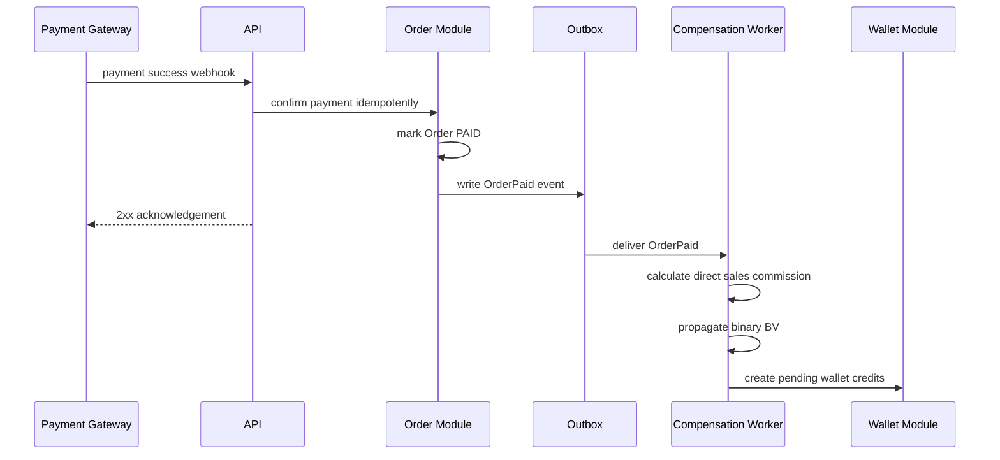
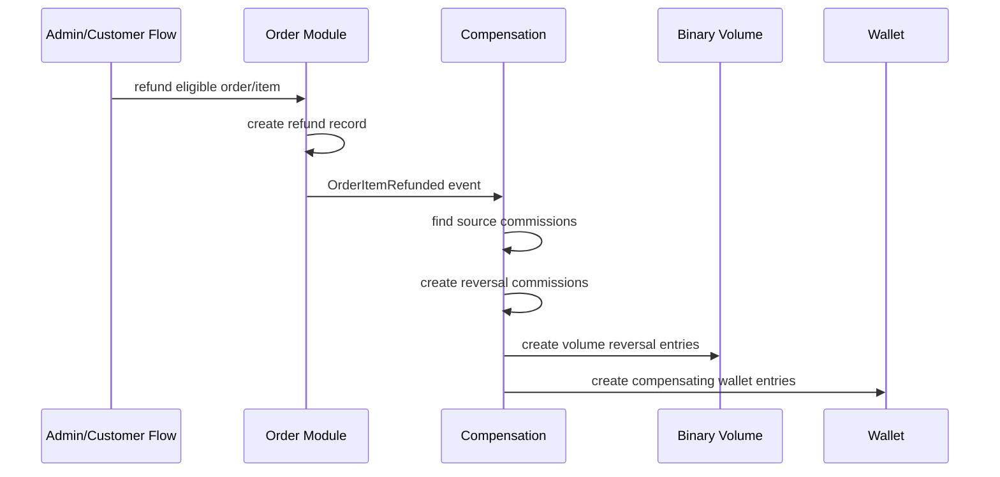

# Software Design Document (SDD)
## Modular White-Label Marketplace with Binary MLM

**Document Type:** Software Design Document  
**Architecture Style:** Modular Monolith + Clean Architecture  
**Primary Business Model:** Admin-owned marketplace with agent-led selling and binary MLM compensation  
**Primary User Types:** Admin, Agent, Customer  
**Extensibility Goal:** Reusable/white-label platform where branding, catalog, business rules, and MLM configuration can be changed from the Admin Dashboard without changing source code  
**Version:** 1.1 — Binary-only compensation simplification

---

# 1. Executive Summary

This document defines the software architecture, business model, domain design, application layer, infrastructure layer, API design, data model, workflows, security model, and deployment strategy for a **modular white-label marketplace with a binary MLM network**.

The platform is designed to be built once and reused for different businesses. An administrator can change the business name, logo, colors, catalog, pricing, product commissionability, binary MLM rules, payout rules, and feature availability from the Admin Dashboard.

The initial operating model is:

1. The **Admin/Organization** owns and manages the marketplace and product catalog.
2. **Agents** promote and sell products using referral links, QR codes, and personal storefront views backed by the same central catalog.
3. **Customers** browse the marketplace, place orders, and pay through the platform.
4. Orders attributed to an Agent can produce configurable commissions and business volume.
5. Agents exist in a **binary placement network** where every Agent has at most two direct placement children: `LEFT` and `RIGHT`.
6. Agents may sponsor/recruit more than two people. Additional recruits are placed deeper according to a configurable spillover/placement strategy.
7. Sponsorship and binary placement are separate concepts.
8. The compensation engine supports a deliberately focused binary model:
   - Direct sales commission for an attributed marketplace sale
   - Binary volume accumulation through LEFT/RIGHT placement ancestry
   - Binary pairing commission
   - Optional qualification rules and payout caps
9. Financial rewards must originate from valid commercial activity such as eligible product sales, not merely from inserting a person into the network.
10. The architecture is tenant-aware so the same codebase can later operate multiple white-label organizations.

The recommended implementation is a **modular monolith** using Clean Architecture. This preserves strong domain boundaries while avoiding the operational complexity of microservices during early development.

---

# 2. Product Vision

The product is a reusable commerce and network-sales platform that can be deployed for different brands without rewriting business logic.

A new business should be configurable through the Admin Dashboard by changing:

- Business name
- Logo and favicon
- Color theme
- Domain/subdomain
- Currency
- Product catalog
- Categories
- Product images
- Prices
- Inventory
- Homepage content
- Marketplace features
- Agent program settings
- Binary placement rules
- Direct-sales commission rules
- Business volume rules
- Pairing rules
- Wallet and payout settings
- Email templates
- Notifications

The long-term product direction is a **white-label commerce + network-sales operating platform** rather than a single hard-coded MLM website.

---

# 3. Scope

## 3.1 In Scope

### Customer Commerce

- Public marketplace
- Product catalog
- Product search/filter
- Product detail pages
- Shopping cart
- Checkout
- Payment processing
- Customer account
- Address management
- Order history
- Order tracking
- Refund/cancellation workflow
- Agent/referral attribution

### Agent Platform

- Agent registration/application
- Agent approval and activation
- Unique referral code
- Referral links
- Product-specific referral links
- QR codes
- Personal storefront route
- Sales dashboard
- Customer/order attribution
- Binary placement tree
- Left/right leg statistics
- Direct recruits
- Downline browsing
- Commission history
- Wallet
- Payout requests
- Qualification status

### Binary MLM

- Unlimited sponsorship/recruitment count
- Maximum two direct binary placement children per Agent
- Left/right placement
- Spillover
- Configurable placement strategy
- Sponsor genealogy
- Placement genealogy
- Binary volume propagation
- Left/right volume balances
- Binary pairing
- Carry-forward rules
- Flush/expiry rules
- Commission reversals
- Qualification rules

### Admin Platform

- Organization settings
- Branding settings
- Feature flags
- User management
- Agent approval
- Agent suspension/reactivation
- Product/category management
- Inventory management
- Order management
- Refund management
- Binary tree inspection
- Manual placement tools with constraints
- Compensation plan configuration
- Binary pairing configuration
- Business volume configuration
- Wallet/payout controls
- Audit log
- Dashboard and reporting

### Platform Capabilities

- Multi-tenant-ready organization boundary
- Role-based authorization
- Auditability
- Idempotent financial processing
- Domain events
- Outbox processing
- Background jobs
- Caching
- Structured logging
- Monitoring
- Backup/recovery

---

## 3.2 Out of Scope for V1

The following are architectural extension points but are not required for the first implementation:

- Third-party merchant marketplace
- Merchant onboarding
- Merchant settlements
- Multi-merchant cart settlement
- Agent-owned physical inventory
- Agent-controlled pricing
- Cryptocurrency/token payouts
- Multiple organizations sharing the same customer identity
- Cross-border tax engines
- Complex rank/generation plans
- Board/cycling compensation
- Fully visual drag-and-drop website builder
- Microservices decomposition

A future Merchant module can be added without redesigning the MLM domain because marketplace ownership and compensation are separated by module boundaries.

---

# 4. Core Business Model

## 4.1 Participants

The platform has three primary participants.

### Admin

The Admin operates the business and owns the marketplace configuration.

Responsibilities:

- Manage branding
- Manage catalog
- Manage inventory
- Manage pricing
- Approve Agents
- Configure binary MLM plan
- Configure business volume
- Configure payouts
- Manage orders/refunds
- Inspect network structure
- Run reports
- Control feature availability

### Agent

An Agent is a marketplace sales/referral participant and a node in the binary MLM network.

Responsibilities:

- Promote marketplace products
- Share referral links/QR codes
- View attributed sales
- Recruit/sponsor new Agents
- View binary downline
- Monitor left/right volume
- Monitor commissions
- Request payouts
- Maintain payout information

An Agent may also behave as a Customer using the same account.

### Customer

A Customer purchases products from the Admin-owned marketplace.

Responsibilities:

- Browse products
- Add items to cart
- Checkout
- Pay
- Track orders
- Request allowed cancellations/refunds
- Manage account and address information

Customers do not see MLM dashboards unless they are also approved Agents.

---

# 5. Commerce and Agent Selling Model

The Admin owns the marketplace, product catalog, base pricing, inventory, checkout, payment processing, fulfillment, and refund rules.

Agents do not need to own stock.

An Agent sells by generating an attributed marketplace visit.

Example:

```text
Agent John
    |
    | shares
    v
https://brand.example/r/JOHN123
    |
    v
Customer browses central marketplace
    |
    v
Customer places order
    |
    v
Order attributed to John
    |
    +--> direct selling commission
    +--> business volume
    +--> binary volume propagation
```

The platform may provide an Agent personal storefront route:

```text
https://brand.example/store/john
```

This storefront is not a separate catalog. It is a filtered/personalized view of the Admin-owned catalog with referral attribution automatically applied.

---

# 6. Binary MLM Business Model

## 6.1 Binary Placement Rule

Every Agent has at most two direct placement positions:

```text
        AGENT
       /     \
    LEFT     RIGHT
```

This is the meaning of binary placement.

An Agent may personally sponsor more than two Agents.

Example sponsorship:

```text
YOU
├── John
├── Carla
├── Carlo
├── Anna
└── Peter
```

But placement remains binary:

```text
              YOU
            /     \
         JOHN     CARLA
        /   \      /
     CARLO  ANNA PETER
```

---

## 6.2 Sponsorship vs Placement

These relationships must be stored separately.

### Sponsorship

Defines who recruited an Agent.

```text
Carlo.SponsorAgentId = YOU
```

### Placement

Defines where the Agent sits in the binary tree.

```text
Carlo.PlacementParentAgentId = JOHN
Carlo.PlacementSide = LEFT
```

Therefore John may have Carlo in his placement downline even when John did not recruit Carlo.

This separation is a mandatory domain invariant.

---

## 6.3 Spillover

If an Agent has both direct placement positions occupied, additional sponsored Agents are placed deeper.

Example:

```text
              YOU
            /     \
         JOHN     CARLA
        /   \
     CARLO  ANNA
```

If YOU sponsors another Agent, that Agent may spill into another open position according to the configured placement strategy.

Supported strategy abstraction:

- Manual placement
- Breadth-first left-to-right
- Preferred-leg breadth-first
- Left-most available
- Right-most available
- Balanced-leg strategy

V1 recommendation:

- Admin chooses default strategy.
- Agent may choose preferred leg when allowed.
- System validates the final placement.
- Existing active placement cannot be changed casually after commissions/volume exist.

---

## 6.4 Network Depth

The binary placement tree may continue growing as the organization expands.

```text
Placement network depth = unlimited
Direct placement children per Agent = maximum 2
```

A deeply placed Agent remains part of every applicable ancestor's LEFT or RIGHT leg according to placement ancestry. This matters for binary volume propagation and leg statistics.

---

# 7. Compensation Model

The compensation engine must be rule-driven and configuration-based.

No percentage should be hard-coded in business logic.

## 7.1 Compensation Sources

The system supports these compensation components as independently enabled modules.

### Direct Sales Commission

Paid to the Agent whose referral attribution produced the customer order.

Example:

```text
Eligible Sale = 10,000
Direct Sales Rate = 10%
Agent Commission = 1,000
```

### Binary Business Volume

Products/order items may generate Business Volume (BV).

Example:

```text
Product Price = 5,000
Business Volume = 500 BV
```

The BV from an Agent-attributed sale is propagated upward through the Agent's placement ancestry.

For every ancestor, the system determines whether the originating Agent is in that ancestor's left or right leg.

### Binary Pairing Commission

A periodic calculation compares available left and right volume.

Example:

```text
Left Available = 12,000 BV
Right Available = 8,000 BV
Matched Volume = 8,000 BV
```

Possible calculation methods:

1. Percentage of matched volume
2. Fixed bonus per pair

V1 should support percentage-based pairing first.

Example:

```text
Matched Volume = 8,000 BV
Pairing Rate = 10%
Gross Binary Bonus = 800
```

Unused volume may carry forward based on plan configuration.

---

## 7.2 Commission Budget

Every product/order item should have a defined commissionable basis.

Recommended fields:

- Sale amount
- Commissionable amount
- Business volume
- Direct sales commission rule
- Binary eligibility

The compensation engine must reject invalid configurations where expected maximum payouts exceed configured economic limits.

The platform should avoid paying commissions solely because someone joins the network. Joining is a network event; product/service sales are commercial events.

---

## 7.3 Carry Forward

Binary volume policy is configurable:

- Carry forward forever
- Carry forward for N periods
- Flush daily
- Flush weekly
- Flush monthly
- Flush when Agent becomes inactive

Recommended V1:

```text
CarryForwardEnabled = true
VolumeExpiry = none
```

Admin may configure a different policy.

---

## 7.4 Qualification Rules

An Agent can be required to satisfy rules before receiving certain commissions.

Examples:

- Account is active
- Minimum personal sales
- Minimum personal BV
- Minimum one active direct recruit on left
- Minimum one active direct recruit on right
- Minimum number of direct Agents
- No compliance/suspension flag

The engine should support a generic qualification evaluator.

---

## 7.5 Earning Caps

Plans may define:

- Daily binary cap
- Weekly binary cap
- Monthly commission cap
- Rank-specific cap

Cap behavior must define what happens to volume that would generate payout beyond the cap:

- preserve volume
- partially consume volume
- burn matched volume

This behavior must be explicit in the compensation plan.

---

## 7.6 Refund and Reversal

If an eligible order is refunded, the platform must be able to reverse:

- Direct sales commission
- Binary volume entries
- Pairing effects where possible
- Wallet credit

Financial history should never be deleted.

Reversals create compensating ledger entries referencing the original transaction.

---

# 8. User-Facing Applications

The system can be one frontend application with role-based areas.

## 8.1 Customer UI

Routes/features:

```text
/
/products
/products/{slug}
/categories/{slug}
/cart
/checkout
/account
/account/orders
/account/addresses
/account/profile
```

Customer capabilities:

- Browse catalog
- Search/filter
- Add to cart
- Checkout
- Pay
- Track orders
- Request cancellation/refund
- Manage account

---

## 8.2 Agent UI

Routes/features:

```text
/agent/dashboard
/agent/network
/agent/network/tree
/agent/referrals
/agent/sales
/agent/earnings
/agent/wallet
/agent/payouts
/agent/tools
/agent/profile
```

Dashboard metrics:

- Available earnings
- Pending earnings
- Lifetime earnings
- Direct sales
- Direct recruits
- Total placement downline
- Left leg members
- Right leg members
- Left available BV
- Right available BV
- Lifetime left/right BV
- Estimated pairing
- Qualification state

The Agent tree UI should support:

- expandable nodes
- search
- depth filter
- left/right filter
- direct recruit filter
- active/inactive status

A table view must also exist because very large trees are difficult to inspect graphically.

---

## 8.3 Admin UI

Suggested sections:

```text
Admin
├── Dashboard
├── Business
│   ├── Organization Profile
│   ├── Branding
│   ├── Domain
│   ├── Currency
│   └── Feature Flags
├── Catalog
│   ├── Products
│   ├── Categories
│   ├── Variants
│   ├── Inventory
│   └── Commission Profiles
├── Orders
│   ├── Orders
│   ├── Payments
│   ├── Refunds
│   └── Fulfillment
├── Agents
│   ├── Applications
│   ├── Active Agents
│   ├── Suspended Agents
│   ├── Placement Tree
│   └── Placement Tools
├── Compensation
│   ├── Plans
│   ├── Direct Sales
│   ├── Binary Pairing
│   ├── Qualification
│   └── Caps / Carry Forward
├── Finance
│   ├── Agent Wallets
│   ├── Payout Requests
│   ├── Commission Ledger
│   └── Reversals
├── Customers
├── Reports
├── Audit Logs
└── Settings
```

---

# 9. Architectural Style

## 9.1 Recommended Architecture

Use a **Modular Monolith with Clean Architecture**.

Reasons:

- Strong separation of business domains
- One deployable application initially
- Easier transactions for orders, commissions, and wallets
- Easier local development
- Lower operational cost than microservices
- Modules can later be extracted if scale demands it

---

## 9.2 Dependency Rule

```text
Presentation/API
       |
       v
Application
       |
       v
Domain

Infrastructure --> Application abstractions
Infrastructure --> Domain
```

The Domain layer must not depend on:

- Web framework
- ORM
- Database
- Payment provider
- Cloud provider
- Email service
- Queue implementation

---

# 10. Logical Modules

Recommended bounded modules:

```text
Organization
Identity
Catalog
Commerce
Network
Compensation
Wallet
Payout
Notification
Reporting
Audit
```

## 10.1 Organization Module

Responsible for:

- White-label identity
- Business settings
- Branding
- Currency
- Feature flags
- Domains

## 10.2 Identity Module

Responsible for:

- Authentication
- Authorization
- Users
- Roles
- Account security

## 10.3 Catalog Module

Responsible for:

- Products
- Categories
- Variants
- Price
- Inventory
- Product BV
- Commission profile assignment

## 10.4 Commerce Module

Responsible for:

- Cart
- Checkout
- Orders
- Order items
- Payments
- Refunds
- Fulfillment
- Referral attribution snapshot

## 10.5 Network Module

Responsible for:

- Agent profile
- Sponsorship
- Binary placement
- Placement side
- Spillover strategy
- Placement closure/path data
- Downline queries

## 10.6 Compensation Module

Responsible for:

- Commission plans
- Direct sales commission
- Binary BV propagation
- Pairing calculations
- Qualification
- Caps
- Carry forward
- Reversals

## 10.7 Wallet Module

Responsible for:

- Agent balances
- Pending/available amounts
- Immutable wallet ledger
- Credits/debits
- Holds
- Adjustments

## 10.8 Payout Module

Responsible for:

- Payout accounts
- Payout requests
- Approval
- Processing
- Failure/retry
- Payment provider integration

## 10.9 Notification Module

Responsible for:

- Email
- SMS/push extension points
- In-app notifications
- Templates

## 10.10 Reporting Module

Responsible for:

- Sales analytics
- Agent analytics
- Network analytics
- Commission reports
- Financial reports

## 10.11 Audit Module

Responsible for:

- Admin actions
- Placement changes
- Compensation configuration changes
- Wallet adjustments
- Refunds
- Security-sensitive events

---

# 11. Suggested Solution Structure

```text
src/
├── Domain/
│   ├── Common/
│   ├── Organizations/
│   ├── Catalog/
│   ├── Commerce/
│   ├── Network/
│   ├── Compensation/
│   ├── Wallets/
│   └── Payouts/
│
├── Application/
│   ├── Common/
│   │   ├── Interfaces/
│   │   ├── Behaviors/
│   │   ├── Security/
│   │   └── Models/
│   ├── Organizations/
│   ├── Catalog/
│   ├── Commerce/
│   ├── Network/
│   ├── Compensation/
│   ├── Wallets/
│   └── Payouts/
│
├── Infrastructure/
│   ├── Persistence/
│   ├── Identity/
│   ├── Payments/
│   ├── Storage/
│   ├── Messaging/
│   ├── BackgroundJobs/
│   ├── Caching/
│   ├── Email/
│   └── Observability/
│
└── Api/
    ├── Endpoints/
    ├── Middleware/
    ├── Filters/
    └── Configuration/
```

An alternative implementation is one Clean Architecture per module. Do not split into separate deployables initially.

---

# 12. Domain Model

# 12.1 Common Domain Types

## Entity

Base concept with stable identity.

## Aggregate Root

Controls transactional consistency for its aggregate.

## Domain Event

Represents an important business fact.

Examples:

- `AgentActivated`
- `AgentPlaced`
- `OrderPaid`
- `OrderRefunded`
- `CommissionCreated`
- `BinaryVolumeCredited`
- `PairingProcessed`
- `PayoutRequested`

## Money Value Object

```text
Money
├── Amount
└── Currency
```

Rules:

- No floating-point arithmetic
- Decimal/fixed precision only
- Currency must match organization currency for V1

---

# 12.2 Organization Aggregate

```text
Organization
├── Id
├── Name
├── Slug
├── Status
├── CurrencyCode
├── TimeZone
├── Locale
├── BrandingSettings
├── CommerceSettings
├── NetworkSettings
└── FeatureSettings
```

### BrandingSettings

```text
LogoUrl
FaviconUrl
PrimaryColor
SecondaryColor
AccentColor
StoreTitle
SupportEmail
SupportPhone
FooterText
```

### FeatureSettings

```text
AgentProgramEnabled
BinaryNetworkEnabled
BinaryPairingEnabled
WalletEnabled
PayoutEnabled
ReviewsEnabled
CouponsEnabled
```

Invariant:

- Every business-owned record must be scoped to an `OrganizationId`.

---

# 12.3 User / Profile Model

Authentication identity may live in Infrastructure, while domain profiles reference the identity UserId.

```text
User
├── Id
├── Email
├── Status
└── Roles
```

Domain profiles:

```text
CustomerProfile
├── Id
├── OrganizationId
├── UserId
├── DisplayName
└── DefaultAddressId
```

```text
Agent
├── Id
├── OrganizationId
├── UserId
├── AgentCode
├── ReferralCode
├── SponsorAgentId?
├── PlacementParentAgentId?
├── PlacementSide?
├── Status
├── ActivatedAt?
├── JoinedAt
└── QualificationState
```

A single User may own both a `CustomerProfile` and an `Agent` profile.

---

# 12.4 Network Domain

## PlacementSide

```text
LEFT
RIGHT
```

## Agent Status

```text
APPLIED
PENDING_APPROVAL
ACTIVE
INACTIVE
SUSPENDED
CLOSED
```

## Placement Invariants

1. An Agent cannot be its own sponsor.
2. An Agent cannot be its own placement parent.
3. Placement must not create a cycle.
4. A placement parent may have at most one LEFT child.
5. A placement parent may have at most one RIGHT child.
6. Sponsor and placement parent may differ.
7. Placement must remain within the same Organization.
8. An Agent cannot occupy two placement positions.
9. Placement changes after activation require privileged workflow and audit.
10. Tree mutation must run in a serializable/locked transaction to prevent two users taking the same slot.

---

# 12.5 Placement Closure Model

For scalable downline and ancestry queries, maintain a placement closure table.

```text
PlacementClosure
├── OrganizationId
├── AncestorAgentId
├── DescendantAgentId
├── Depth
└── FirstLeg
```

Example:

```text
YOU
  LEFT -> JOHN
           LEFT -> CARLO
```

Closure rows include:

```text
Ancestor=YOU   Descendant=JOHN   Depth=1   FirstLeg=LEFT
Ancestor=YOU   Descendant=CARLO  Depth=2   FirstLeg=LEFT
Ancestor=JOHN  Descendant=CARLO  Depth=1   FirstLeg=LEFT
```

Benefits:

- Fast left/right counts
- Fast depth-scoped downline queries
- Fast ancestor lookup
- Fast leg volume propagation
- Avoid repeated deep recursive queries for every sale

Closure rows are written transactionally when placement is created.

---

# 12.6 Catalog Domain

```text
Product
├── Id
├── OrganizationId
├── Name
├── Slug
├── Description
├── Status
├── CategoryId
├── Brand
├── DefaultImageUrl
├── CommissionProfileId?
└── Variants
```

```text
ProductVariant
├── Id
├── ProductId
├── SKU
├── Price
├── BusinessVolume
├── StockKeepingEnabled
├── Weight?
└── Attributes
```

Dynamic attributes may be represented as validated JSON or normalized attribute tables depending on search requirements.

### ProductCommissionProfile

```text
ProductCommissionProfile
├── Id
├── OrganizationId
├── Name
├── DirectSalesEligible
├── DirectSalesRateOverride?
├── BinaryVolumeEligible
├── BinaryVolumeOverride?
└── EffectiveDateRange
```

This prevents hard-coding compensation rules directly into product logic.

---

# 12.7 Cart Domain

```text
Cart
├── Id
├── OrganizationId
├── CustomerId?
├── SessionId?
├── ReferralContext
└── Items
```

ReferralContext:

```text
AgentId?
ReferralCode?
CapturedAt?
AttributionSource?
```

The final Order must snapshot attribution so later referral changes do not rewrite history.

---

# 12.8 Order Aggregate

```text
Order
├── Id
├── OrganizationId
├── OrderNumber
├── CustomerId
├── AttributedAgentId?
├── Status
├── PaymentStatus
├── Currency
├── Subtotal
├── DiscountTotal
├── ShippingTotal
├── TaxTotal
├── GrandTotal
├── ShippingAddress
├── BillingAddress
├── CreatedAt
└── OrderItems
```

```text
OrderItem
├── Id
├── ProductId
├── ProductVariantId
├── ProductNameSnapshot
├── SKUSnapshot
├── UnitPrice
├── Quantity
├── LineTotal
├── CommissionableAmount
├── BusinessVolume
├── CommissionProfileId?
└── FulfillmentStatus
```

Order item values are snapshots and must not change when product configuration changes later.

Order status example:

```text
PENDING_PAYMENT
PAID
PROCESSING
SHIPPED
DELIVERED
CANCELLED
PARTIALLY_REFUNDED
REFUNDED
```

---

# 12.9 Commission Plan Aggregate

```text
CommissionPlan
├── Id
├── OrganizationId
├── Name
├── Status
├── EffectiveFrom
├── EffectiveTo?
├── DirectSalesRule
├── BinaryPairingRule
├── QualificationRules
└── CapRules
```

Plans are versioned.

Orders/commission calculations should store the plan version used.

Never mutate historical commission meaning by editing an active plan in place. Instead publish a new plan version.

---

# 12.10 Binary Pairing Rule

```text
BinaryPairingRule
├── Enabled
├── CalculationType
├── PairingRate?
├── PairUnitBV?
├── FixedPairAmount?
├── ProcessingFrequency
├── CarryForwardEnabled
├── VolumeExpiryPolicy
├── CapPolicy
└── QualificationRuleSetId?
```

CalculationType:

```text
PERCENTAGE_MATCHED_VOLUME
FIXED_PER_PAIR
```

---

# 12.11 Binary Volume Ledger

Do not derive financially important volume only from mutable counters.

Use an immutable ledger.

```text
BinaryVolumeEntry
├── Id
├── OrganizationId
├── OwnerAgentId
├── SourceAgentId
├── SourceOrderItemId
├── Side
├── Volume
├── EntryType
├── EffectiveAt
├── ReversalOfEntryId?
└── CreatedAt
```

EntryType:

```text
CREDIT
REVERSAL
ADJUSTMENT
PAIR_CONSUMPTION
EXPIRY
```

A derived/materialized balance may exist:

```text
BinaryVolumeBalance
├── AgentId
├── LeftAvailable
├── RightAvailable
├── LeftLifetime
├── RightLifetime
└── Version
```

The ledger is the source of truth; the balance is a performance optimization.

---

# 12.12 Commission Transaction

```text
CommissionTransaction
├── Id
├── OrganizationId
├── BeneficiaryAgentId
├── SourceOrderId
├── SourceOrderItemId?
├── SourceAgentId?
├── CommissionPlanVersionId
├── RuleId
├── Type
├── BaseAmount
├── Rate?
├── Amount
├── Status
├── AvailableAt?
├── ReversalOfCommissionId?
└── CreatedAt
```

Type:

```text
DIRECT_SALE
BINARY_PAIRING
BONUS
ADJUSTMENT
REVERSAL
```

Status:

```text
PENDING
AVAILABLE
PAID
REVERSED
HELD
```

Unique/idempotency constraints should prevent duplicate commission generation for the same source/rule/beneficiary.

---

# 12.13 Wallet Aggregate

```text
AgentWallet
├── Id
├── OrganizationId
├── AgentId
├── Currency
└── Status
```

Ledger:

```text
WalletEntry
├── Id
├── WalletId
├── Type
├── Amount
├── SourceType
├── SourceId
├── AvailableAt?
├── ReversalOfEntryId?
└── CreatedAt
```

Balances:

- Pending
- Available
- Held
- Paid lifetime

Wallet entries are immutable.

---

# 12.14 Payout Domain

```text
PayoutAccount
├── Id
├── AgentId
├── Method
├── MaskedAccountData
├── VerificationStatus
└── IsDefault
```

```text
PayoutRequest
├── Id
├── AgentId
├── Amount
├── Currency
├── Status
├── RequestedAt
├── ApprovedAt?
├── ProcessedAt?
└── ProviderReference?
```

Statuses:

```text
REQUESTED
UNDER_REVIEW
APPROVED
PROCESSING
PAID
REJECTED
FAILED
CANCELLED
```

---

# 13. Domain Services

Use domain services only for business logic that does not naturally belong to one aggregate.

Recommended services:

## PlacementPolicy

Responsibilities:

- Find valid placement slot
- Apply configured strategy
- Validate leg availability
- Prevent cycles

## ReferralAttributionPolicy

Responsibilities:

- Resolve which Agent gets sale attribution
- Apply attribution duration
- Resolve conflicts

## DirectSalesCommissionCalculator

Responsibilities:

- Calculate the selling Agent's direct sales commission
- Respect product eligibility, qualification, commission budget, and caps

## BinaryVolumePropagationService

Responsibilities:

- Find placement ancestors
- Determine ancestor leg
- Create idempotent volume entries

## BinaryPairingCalculator

Responsibilities:

- Calculate matchable volume
- Apply rate/pair rule
- Apply caps
- Determine volume consumption
- Determine carry forward

## QualificationEvaluator

Responsibilities:

- Evaluate configurable Agent eligibility

---

# 14. Domain Events

Important events:

```text
OrganizationBrandingChanged
ProductPublished
AgentApplicationSubmitted
AgentApproved
AgentActivated
AgentPlaced
AgentSuspended
ReferralCaptured
OrderCreated
PaymentAuthorized
OrderPaid
OrderDelivered
OrderRefunded
CommissionCalculated
CommissionAvailable
CommissionReversed
BinaryVolumeCredited
BinaryVolumeReversed
BinaryPairingProcessed
WalletCredited
WalletDebited
PayoutRequested
PayoutCompleted
PayoutFailed
```

Events that cross module boundaries should be persisted through an Outbox.

---

# 15. Application Layer

The Application layer coordinates use cases.

It contains:

- Commands
- Queries
- Handlers
- DTOs
- Validators
- Authorization policies
- Application interfaces
- Transaction boundaries
- Idempotency coordination

It must not contain infrastructure details.

---

# 16. Application Interfaces

Recommended abstractions:

```text
IApplicationDbContext
IUnitOfWork
ICurrentUser
ICurrentOrganization
IClock
IPaymentGateway
IObjectStorage
IEmailSender
INotificationSender
IBackgroundJobScheduler
IOutboxPublisher
ICache
IIdempotencyStore
IPayoutProvider
```

---

# 17. Core Application Use Cases

## 17.1 Organization / Branding

Commands:

- `UpdateOrganizationProfileCommand`
- `UpdateBrandingCommand`
- `UpdateFeatureSettingsCommand`
- `UpdateCommerceSettingsCommand`
- `PublishBrandingCommand`

Queries:

- `GetPublicOrganizationConfigQuery`
- `GetAdminOrganizationSettingsQuery`

---

## 17.2 Catalog

Commands:

- `CreateProductCommand`
- `UpdateProductCommand`
- `PublishProductCommand`
- `ArchiveProductCommand`
- `AdjustInventoryCommand`
- `AssignCommissionProfileCommand`

Queries:

- `GetProductsQuery`
- `GetProductBySlugQuery`
- `GetAdminProductQuery`
- `GetInventoryQuery`

---

## 17.3 Customer Commerce

Commands:

- `AddCartItemCommand`
- `UpdateCartItemCommand`
- `RemoveCartItemCommand`
- `ApplyReferralCodeCommand`
- `CreateCheckoutCommand`
- `ConfirmPaymentCommand`
- `RequestCancellationCommand`
- `RequestRefundCommand`

Queries:

- `GetCartQuery`
- `GetMyOrdersQuery`
- `GetOrderDetailsQuery`

---

## 17.4 Agent Onboarding

Commands:

- `ApplyAsAgentCommand`
- `ApproveAgentCommand`
- `RejectAgentCommand`
- `ActivateAgentCommand`
- `SuspendAgentCommand`
- `ReactivateAgentCommand`

Queries:

- `GetAgentApplicationQuery`
- `GetAgentProfileQuery`

---

## 17.5 Binary Placement

Commands:

- `PlaceAgentCommand`
- `AutoPlaceAgentCommand`
- `SetPreferredLegCommand`
- `AdminMoveUncommittedPlacementCommand`

Queries:

- `GetBinaryTreeQuery`
- `GetDownlineQuery`
- `GetDirectPlacementChildrenQuery`
- `GetPlacementAncestorsQuery`

Placement command behavior:

1. Load Agent and Sponsor.
2. Resolve desired placement strategy.
3. Lock required placement scope.
4. Validate slot.
5. Update Agent placement fields.
6. Insert placement closure records.
7. Commit.
8. Publish `AgentPlaced` via Outbox.

---

## 17.6 Agent Referral Tools

Commands:

- `RegenerateReferralCodeCommand`
- `CreateProductReferralLinkCommand`

Queries:

- `GetReferralDashboardQuery`
- `GetReferralLinkQuery`
- `GetAgentStorefrontQuery`

---

## 17.7 Compensation

Commands/internal jobs:

- `ProcessPaidOrderCommissionsCommand`
- `PropagateBinaryVolumeCommand`
- `ProcessBinaryPairingCommand`
- `ReleasePendingCommissionsCommand`
- `ReverseOrderCompensationCommand`
- `ApplyManualCommissionAdjustmentCommand`

Queries:

- `GetAgentEarningsSummaryQuery`
- `GetAgentCommissionHistoryQuery`
- `GetCommissionDetailsQuery`
- `GetBinaryVolumeSummaryQuery`
- `GetPairingHistoryQuery`

---

## 17.8 Wallet / Payout

Commands:

- `RequestPayoutCommand`
- `ApprovePayoutCommand`
- `RejectPayoutCommand`
- `ProcessPayoutCommand`
- `CancelPayoutCommand`

Queries:

- `GetWalletSummaryQuery`
- `GetWalletEntriesQuery`
- `GetPayoutHistoryQuery`

---

# 18. Command Validation Rules

Examples:

## PlaceAgent

- Caller authorized
- Agent ACTIVE or eligible for activation
- Agent not already placed
- Parent exists
- Parent belongs to same Organization
- Parent has requested side available
- No cycle
- Placement policy permits requested position

## CreateCheckout

- Cart not empty
- Products active
- Prices revalidated server-side
- Inventory available
- Referral attribution valid
- Currency matches Organization

## RequestPayout

- Agent active
- Payout account verified
- Amount >= minimum
- Amount <= available wallet balance
- No blocking compliance/admin hold

---

# 19. Application Transaction Boundaries

The following operations should be atomic where possible:

- Place Agent + closure rows
- Create Order + order item snapshots
- Mark payment as paid + enqueue order-paid processing
- Create commission entries + wallet pending entries
- Process pairing + consume volume + create pairing commission
- Refund + reversal ledger entries
- Payout reservation + wallet hold

External provider calls should not be kept inside long database transactions.

Use state machines + idempotency around payment and payout providers.

---

# 20. Infrastructure Layer

The Infrastructure layer implements Application interfaces.

Recommended submodules:

```text
Infrastructure
├── Persistence
├── Identity
├── Payments
├── Payouts
├── Storage
├── Caching
├── Messaging
├── BackgroundJobs
├── Email
├── Observability
└── Security
```

---

# 21. Persistence Design

Recommended relational database: PostgreSQL or another transactional RDBMS with strong locking and indexing support.

Why relational storage fits:

- Orders are transactional
- Wallets require integrity
- Network relationships require constraints
- Compensation is relational and auditable
- Recursive/closure queries are practical

Use migrations.

All tenant-owned tables should include `OrganizationId`.

---

# 22. Suggested Database Tables

```text
Organizations
OrganizationBranding
OrganizationFeatures
Users
UserRoles
CustomerProfiles
Agents
PlacementClosure
Categories
Products
ProductVariants
InventoryItems
ProductCommissionProfiles
Carts
CartItems
Orders
OrderItems
Payments
Refunds
CommissionPlans
CommissionPlanVersions
BinaryPairingRules
QualificationRules
CommissionTransactions
BinaryVolumeEntries
BinaryVolumeBalances
AgentWallets
WalletEntries
PayoutAccounts
PayoutRequests
ReferralAttributions
OutboxMessages
ProcessedMessages
AuditLogs
```

---

# 23. Key Database Constraints

## Agents

Unique:

```text
(OrganizationId, UserId)
(OrganizationId, AgentCode)
(OrganizationId, ReferralCode)
```

Binary direct child uniqueness:

```text
UNIQUE (OrganizationId, PlacementParentAgentId, PlacementSide)
WHERE PlacementParentAgentId IS NOT NULL
```

This database constraint is essential because application-level checks alone can race.

## PlacementClosure

Unique:

```text
(OrganizationId, AncestorAgentId, DescendantAgentId)
```

## Commission Transactions

Recommended idempotency key:

```text
UNIQUE (
  OrganizationId,
  SourceOrderItemId,
  BeneficiaryAgentId,
  RuleId,
  Type
)
```

Adjusted as needed for non-order commissions.

## Binary Volume Entries

For original order volume propagation:

```text
UNIQUE (
  OrganizationId,
  SourceOrderItemId,
  OwnerAgentId,
  EntryType
)
```

Use separate unique semantics for reversals.

---

# 24. Referral Attribution Design

When a customer visits through an Agent link, store referral context.

Example:

```text
/r/JOHN123
```

The system resolves:

```text
ReferralCode -> AgentId
```

Recommended attribution precedence:

1. Explicit valid referral code on current checkout/session
2. Existing unexpired customer referral attribution
3. No Agent attribution

Configurable fields:

```text
AttributionWindowDays
AllowReferralOverride
ReferralLockAfterFirstPurchase
```

The Order snapshots `AttributedAgentId` at checkout/payment time.

Historical orders must not change if the customer later opens another Agent link.

---

# 25. Binary Placement Algorithm

Define an abstraction:

```text
IPlacementStrategy
  FindPlacementAsync(sponsorAgentId, preferredLeg, organizationId)
```

V1 recommended strategy: `PreferredLegBreadthFirstStrategy`.

Pseudo-flow:

```text
1. If sponsor has requested direct slot open -> use it.
2. Otherwise select all descendants under preferred leg in breadth-first order.
3. Find first descendant with an available child slot.
4. Select LEFT before RIGHT unless strategy says otherwise.
5. Acquire lock / verify slot remains available.
6. Commit placement.
```

Admin may instead configure a global breadth-first left-to-right strategy.

Concurrency must be handled with a database uniqueness constraint and retry policy.

---

# 26. Placement Closure Write Algorithm

When Agent C is placed under Parent P:

1. Insert self row if self rows are used:

```text
Ancestor=C, Descendant=C, Depth=0
```

2. Insert parent relation:

```text
Ancestor=P, Descendant=C, Depth=1, FirstLeg=PlacementSide
```

3. For each ancestor A of P:

```text
Ancestor=A
Descendant=C
Depth=A->P depth + 1
FirstLeg=A->P FirstLeg
```

For P's parent and above, the new Agent belongs to the same first leg as P relative to that ancestor.

This operation must be transactionally consistent.

---

# 27. Paid Order Compensation Workflow

When payment is confirmed:



Processing rules:

1. Load Order snapshot.
2. Verify Order not already compensated.
3. Resolve active Commission Plan version.
4. For each eligible OrderItem:
   - calculate direct sale commission
   - create volume propagation entries
5. Create CommissionTransactions.
6. Create pending WalletEntries.
7. Commit.
8. Mark source event processed.

---

# 28. Binary Volume Propagation Algorithm

For each eligible OrderItem attributed to Agent `A` with `BV = X`:

1. Query all placement ancestors of `A`.
2. For each ancestor:
   - determine `FirstLeg` from PlacementClosure
   - create a BinaryVolumeEntry for `X` on LEFT or RIGHT
3. Update materialized balance using optimistic concurrency or atomic SQL.
4. Use unique source constraints to prevent duplicate propagation.

Example:

```text
YOU
 LEFT -> JOHN
          LEFT -> CARLO
                   LEFT -> SARAH
```

Sarah produces 500 BV.

Entries:

```text
Owner=CARLO  Side=LEFT  Volume=500
Owner=JOHN   Side=LEFT  Volume=500
Owner=YOU    Side=LEFT  Volume=500
```

Sarah's own sale does not count toward Sarah's left/right leg volume unless the compensation plan explicitly defines self-volume behavior. Personal volume should be tracked separately.

---

# 29. Binary Pairing Workflow

Pairing may run daily, weekly, or on another configured schedule.

For each eligible Agent:

1. Load available LEFT BV.
2. Load available RIGHT BV.
3. Evaluate qualification.
4. Determine matched volume:

```text
Matched = MIN(LeftAvailable, RightAvailable)
```

5. Calculate bonus.
6. Apply caps.
7. Determine consumed volume.
8. Create `PAIR_CONSUMPTION` ledger entries.
9. Create `CommissionTransaction`.
10. Create pending/available WalletEntry.
11. Save `PairingRun` audit details.

A dedicated record is recommended:

```text
BinaryPairingRun
├── Id
├── AgentId
├── PeriodStart
├── PeriodEnd
├── LeftBefore
├── RightBefore
├── MatchedVolume
├── LeftConsumed
├── RightConsumed
├── LeftAfter
├── RightAfter
├── GrossCommission
├── NetCommission
├── CapApplied
└── CreatedAt
```

---

# 30. Refund Compensation Reversal Workflow



Rules:

- Never delete original commission.
- Never delete original volume entry.
- Create reversal entries.
- If payout already occurred, wallet may become negative or create recoverable balance based on Admin policy.

---

# 31. Wallet Availability Workflow

Commissions can remain `PENDING` until a configurable condition occurs.

Examples:

- Order delivered
- Return window expired
- N days after payment

Recommended V1:

```text
Payment -> Commission PENDING
Delivery/return-window completion -> Commission AVAILABLE
```

This reduces overpayment before refunds.

---

# 32. REST API Design

Base path:

```text
/api/v1
```

The exact framework is implementation-specific.

---

# 33. Public / Customer APIs

## Organization / Branding

```http
GET /api/v1/public/config
```

Returns:

- Business name
- Logo URLs
- theme
- enabled public features
- currency

## Products

```http
GET /api/v1/products
GET /api/v1/products/{slug}
GET /api/v1/categories
GET /api/v1/categories/{slug}/products
```

## Referral

```http
GET /api/v1/referrals/{code}
POST /api/v1/referrals/capture
```

## Cart

```http
GET    /api/v1/cart
POST   /api/v1/cart/items
PATCH  /api/v1/cart/items/{itemId}
DELETE /api/v1/cart/items/{itemId}
```

## Checkout

```http
POST /api/v1/checkout
POST /api/v1/checkout/payment-session
```

## Customer Orders

```http
GET  /api/v1/me/orders
GET  /api/v1/me/orders/{orderId}
POST /api/v1/me/orders/{orderId}/cancel-request
POST /api/v1/me/orders/{orderId}/refund-request
```

---

# 34. Agent APIs

## Dashboard

```http
GET /api/v1/agent/dashboard
```

## Network

```http
GET /api/v1/agent/network/tree?depth=4
GET /api/v1/agent/network/downline?page=1&pageSize=50
GET /api/v1/agent/network/legs/left
GET /api/v1/agent/network/legs/right
GET /api/v1/agent/network/direct-recruits
```

## Referral Tools

```http
GET  /api/v1/agent/referral
POST /api/v1/agent/referral/product-links
GET  /api/v1/agent/storefront
```

## Sales

```http
GET /api/v1/agent/sales
GET /api/v1/agent/sales/{orderId}
```

Agent sales responses must hide customer information that the Agent is not allowed to see.

## Earnings

```http
GET /api/v1/agent/earnings/summary
GET /api/v1/agent/earnings/commissions
GET /api/v1/agent/earnings/commissions/{id}
GET /api/v1/agent/earnings/pairings
```

## Volume

```http
GET /api/v1/agent/volume
GET /api/v1/agent/volume/ledger
```

## Wallet / Payout

```http
GET  /api/v1/agent/wallet
GET  /api/v1/agent/wallet/transactions
GET  /api/v1/agent/payouts
POST /api/v1/agent/payouts
```

---

# 35. Admin APIs

## Branding

```http
GET /api/v1/admin/organization
PUT /api/v1/admin/organization
PUT /api/v1/admin/branding
PUT /api/v1/admin/features
```

## Catalog

```http
GET    /api/v1/admin/products
POST   /api/v1/admin/products
GET    /api/v1/admin/products/{id}
PUT    /api/v1/admin/products/{id}
POST   /api/v1/admin/products/{id}/publish
POST   /api/v1/admin/products/{id}/archive
POST   /api/v1/admin/inventory/adjustments
```

## Orders

```http
GET  /api/v1/admin/orders
GET  /api/v1/admin/orders/{id}
POST /api/v1/admin/orders/{id}/refund
POST /api/v1/admin/orders/{id}/cancel
```

## Agents

```http
GET  /api/v1/admin/agents
GET  /api/v1/admin/agents/{id}
POST /api/v1/admin/agents/{id}/approve
POST /api/v1/admin/agents/{id}/suspend
POST /api/v1/admin/agents/{id}/reactivate
POST /api/v1/admin/agents/{id}/place
GET  /api/v1/admin/network/tree
```

## Compensation Plans

```http
GET  /api/v1/admin/compensation/plans
POST /api/v1/admin/compensation/plans
GET  /api/v1/admin/compensation/plans/{id}
PUT  /api/v1/admin/compensation/plans/{id}
POST /api/v1/admin/compensation/plans/{id}/publish
POST /api/v1/admin/compensation/plans/{id}/retire
```

## Wallets / Payouts

```http
GET  /api/v1/admin/wallets
GET  /api/v1/admin/payouts
POST /api/v1/admin/payouts/{id}/approve
POST /api/v1/admin/payouts/{id}/reject
POST /api/v1/admin/payouts/{id}/process
POST /api/v1/admin/wallets/{agentId}/adjustments
```

## Audit

```http
GET /api/v1/admin/audit-logs
```

---

# 36. API Error Model

Use a consistent problem format.

Example:

```json
{
  "type": "https://example/errors/placement-slot-occupied",
  "title": "Placement slot is already occupied",
  "status": 409,
  "code": "NETWORK.PLACEMENT_SLOT_OCCUPIED",
  "traceId": "...",
  "errors": []
}
```

Recommended error namespaces:

```text
AUTH.*
ORG.*
CATALOG.*
ORDER.*
PAYMENT.*
NETWORK.*
COMPENSATION.*
WALLET.*
PAYOUT.*
```

---

# 37. Authentication and Authorization

Roles:

```text
ADMIN
AGENT
CUSTOMER
```

A user may have multiple roles.

Example:

```text
John:
CUSTOMER
AGENT
```

Permissions should be capability-based internally rather than checking only role names.

Examples:

```text
Catalog.Read
Catalog.Manage
Orders.ReadOwn
Orders.Manage
Agent.Network.ReadOwn
Agent.Earnings.ReadOwn
Compensation.Manage
Wallet.Adjust
Payout.Approve
Audit.Read
```

Security rule:

Every query and command must be scoped by Organization and authorization policy.

Do not rely on frontend route hiding for security.

---

# 38. Security Requirements

## Authentication

- Strong password hashing
- Secure session/token lifecycle
- Refresh/revocation support if tokens are used
- Email verification
- MFA strongly recommended for Admin

## Authorization

- RBAC + permissions
- Organization scope enforcement
- Object ownership checks
- Prevent IDOR

## Payments

- Validate payment webhooks
- Verify provider signatures
- Idempotent webhook processing
- Never trust client-supplied payment success

## Financial Integrity

- No floating point
- Immutable financial ledgers
- Unique idempotency keys
- Audit manual adjustments
- Admin wallet adjustments require reason

## Sensitive Data

- Encrypt secrets
- Do not store raw card data
- Minimize payout-account data
- Mask account details in UI
- Restrict sensitive logs

## Web Security

- CSRF protection where applicable
- XSS prevention
- CSP
- Secure cookies
- Rate limiting
- Input validation
- File upload validation

---

# 39. Audit Requirements

Audit the following:

- Admin login/security events
- Agent approval
- Agent suspension
- Placement operations
- Manual placement changes
- Commission plan changes
- Product commission profile changes
- Manual wallet adjustments
- Refunds
- Payout approvals/rejections
- Branding changes
- Feature flag changes

Audit record:

```text
AuditLog
├── Id
├── OrganizationId
├── ActorUserId
├── Action
├── EntityType
├── EntityId
├── BeforeJson?
├── AfterJson?
├── Reason?
├── IpAddress?
├── UserAgent?
└── CreatedAt
```

---

# 40. Background Processing

Recommended background jobs:

- Outbox dispatcher
- Payment reconciliation
- Commission pending-to-available release
- Binary pairing run
- Volume expiry/flush
- Payout processing
- Email dispatch
- Abandoned cart cleanup
- Inventory reconciliation
- Reporting projections

Jobs must be idempotent.

If a worker retries, it must not duplicate commission or wallet entries.

---

# 41. Outbox / Idempotency Pattern

When a module transaction generates a cross-module event:

1. Update domain data.
2. Insert OutboxMessage in the same DB transaction.
3. Commit.
4. Background dispatcher publishes/processes the message.
5. Consumer records message ID in `ProcessedMessages`.

This prevents lost `OrderPaid` or `OrderRefunded` events.

---

# 42. Caching

Good cache candidates:

- Public organization config
- Branding config
- Product catalog pages
- Product detail
- Category lists
- Feature flags

Avoid using cache as the source of truth for:

- Wallet balances
- Commission calculations
- Placement slot availability
- Payment status
- Inventory reservation

Cache invalidation events:

- BrandingUpdated
- ProductUpdated
- ProductPublished
- FeatureSettingsUpdated

---

# 43. Search

V1 may use database text search for products.

Future dedicated search engine may be introduced when needed.

Search should not be coupled to the Product aggregate implementation.

---

# 44. File / Media Storage

Use object storage through `IObjectStorage` for:

- Product images
- Organization logos
- Favicons
- Agent avatars
- Optional documents

Database stores object keys/URLs, not large file blobs.

---

# 45. Payment Integration

Abstract payment provider:

```text
IPaymentGateway
├── CreatePaymentSession
├── CapturePayment
├── RefundPayment
├── GetPaymentStatus
└── ValidateWebhook
```

Order processing must not depend on one gateway.

Payment records:

```text
Payment
├── Id
├── OrderId
├── Provider
├── ProviderReference
├── Amount
├── Currency
├── Status
├── IdempotencyKey
└── CreatedAt
```

---

# 46. Payout Integration

Agent payouts are separate from customer payment collection.

Abstract provider:

```text
IPayoutProvider
├── ValidateAccount
├── CreatePayout
├── GetPayoutStatus
└── CancelPayout
```

The wallet is the internal source of truth.

External payout provider status must reconcile back into the payout state machine.

---

# 47. Inventory

V1 recommended inventory model:

```text
InventoryItem
├── OrganizationId
├── ProductVariantId
├── OnHand
├── Reserved
├── Available
└── Version
```

Checkout may reserve inventory for a short period.

Rules:

```text
Available = OnHand - Reserved
```

Use atomic/optimistic concurrency to avoid overselling.

---

# 48. White-Label Configuration

The platform should read branding from Organization configuration.

Example public config:

```json
{
  "organization": {
    "name": "Example Brand",
    "slug": "example-brand",
    "currency": "PHP"
  },
  "branding": {
    "logoUrl": "/assets/logo.svg",
    "primaryColor": "#123456",
    "secondaryColor": "#ffffff",
    "faviconUrl": "/favicon.ico"
  },
  "features": {
    "agentProgram": true,
    "binaryNetwork": true,
    "binaryPairing": true
  }
}
```

Frontend components consume configuration rather than hard-coded business names.

---

# 49. Tenant / Organization Strategy

Even if V1 runs one business, include `OrganizationId` from the beginning.

Two deployment modes can then be supported later:

### Dedicated White-Label Deployment

```text
One deployment
One Organization
One domain
```

### Shared SaaS Deployment

```text
One platform deployment
Multiple Organizations
Organization resolved by domain/subdomain
```

Recommended V1:

- application is tenant-aware
- operational deployment may still contain only one Organization

This provides future reuse without forcing full multi-tenant operational complexity immediately.

---

# 50. Business Rules Summary

1. Every Agent belongs to one Organization.
2. Every Agent has at most one sponsor.
3. Every Agent has at most one placement parent.
4. Every placement parent has maximum two direct placement children.
5. Placement sides are LEFT and RIGHT.
6. Sponsorship and placement are independent relationships.
7. Agents may sponsor unlimited Agents.
8. Binary placement depth is unlimited unless an Organization explicitly imposes an operational display/query limit.
9. Products determine direct-sales commission and BV eligibility through profiles.
10. Orders snapshot compensation-relevant values.
11. Compensation rules are versioned.
12. Every financial transaction is auditable.
13. Refunds use reversals, not deletion.
14. Payment success must be server/provider verified.
15. Placement must not create cycles.
16. Agents cannot claim another Organization's members.
17. Customer orders may be unattributed to an Agent.
18. Agents may also be Customers.
19. Binary pairing is calculated from matched LEFT/RIGHT volume according to the active pairing rule.
20. Admin controls business and compensation configuration.

---

# 51. Example End-to-End Scenario

Assume:

```text
YOU = root Agent
John = left child
Carla = right child
Carlo = sponsored by YOU but spilled under John LEFT
Anna = sponsored by John and placed under John RIGHT
```

Placement:

```text
              YOU
            /     \
         JOHN     CARLA
        /   \
     CARLO  ANNA
```

Sponsorship:

```text
YOU
├── John
├── Carla
└── Carlo

John
└── Anna
```

Carlo shares a product link.

Customer buys:

```text
Order Total = 10,000
Commissionable Amount = 8,000
Business Volume = 1,000 BV
```

Possible configured results:

```text
Direct Selling Commission
Carlo receives configured direct rate.

Binary Volume
John receives +1,000 BV on LEFT.
YOU receives +1,000 BV on LEFT.
```

If John later has:

```text
LEFT = 6,000 BV
RIGHT = 4,000 BV
```

Then matched volume is:

```text
4,000 BV
```

At a 10% pairing rate:

```text
Binary commission = 400
```

If carry forward is enabled:

```text
LEFT remaining = 2,000 BV
RIGHT remaining = 0 BV
```

This demonstrates that:

- Carlo can be sponsored by YOU.
- Carlo can be placed under John.
- John can benefit from Carlo's placement activity.
- YOU can also benefit because John's branch is part of YOUR left leg.
- John and YOU may independently earn binary pairing bonuses from their own LEFT/RIGHT balances when each satisfies the pairing rules.

---

# 52. State Machines

## 53.1 Agent

```text
APPLIED
  -> PENDING_APPROVAL
  -> ACTIVE
  -> SUSPENDED
  -> ACTIVE
  -> CLOSED
```

## 53.2 Order

```text
PENDING_PAYMENT
  -> PAID
  -> PROCESSING
  -> SHIPPED
  -> DELIVERED

PAID/PROCESSING
  -> CANCELLED

PAID/DELIVERED
  -> PARTIALLY_REFUNDED
  -> REFUNDED
```

## 53.3 Commission

```text
PENDING
  -> AVAILABLE
  -> PAID

PENDING/AVAILABLE/PAID
  -> REVERSED

PENDING/AVAILABLE
  -> HELD
```

## 53.4 Payout

```text
REQUESTED
 -> UNDER_REVIEW
 -> APPROVED
 -> PROCESSING
 -> PAID

UNDER_REVIEW
 -> REJECTED

PROCESSING
 -> FAILED
```

---

# 53. Reporting Requirements

## Admin Reports

- Gross sales
- Net sales
- Orders
- Refunds
- Sales by product
- Sales by Agent
- Top Agents
- New Agents
- Active Agents
- Network growth
- Left/right volume totals
- Commission expense
- Commission by type
- Pending liabilities
- Wallet liability
- Payout history

## Agent Reports

- My sales
- My attributed orders
- My direct recruits
- My placement downline
- Left/right members
- Left/right BV
- Commissions by type
- Commission details
- Payout history

---

# 54. Privacy Rules for Agent Visibility

Agents should not automatically see all private customer data.

Recommended visibility:

Agent may see:

- Order reference
- Order date
- Amount relevant to commission
- Product summary
- Commission generated
- Customer display name or masked identity if business requires it

Agent should not automatically see:

- Full payment details
- Sensitive customer profile data
- Another Agent's wallet
- Another Agent's full customer list unless business rule explicitly permits it

Downline visibility must also be scoped to descendants.

---

# 55. Non-Functional Requirements

## Performance

Targets for normal operations:

- Public catalog read p95 < 500 ms excluding external dependencies
- Dashboard read p95 < 1 second for cached/optimized summaries
- Placement write < 2 seconds under normal load
- Checkout API server processing < 1 second excluding provider redirect/API time

## Scalability

System should support:

- large placement trees
- thousands to hundreds of thousands of Agents
- high read traffic on catalog
- batch pairing calculations

Use:

- placement closure table
- indexes
- materialized balances/projections
- background jobs
- pagination
- caching

## Availability

Target initial service availability:

```text
99.9% monthly
```

Financial background jobs may recover asynchronously after temporary outages.

## Consistency

Strong consistency required for:

- placement slot allocation
- payment state transition
- wallet movement
- commission creation
- payout reservation

Eventual consistency acceptable for:

- analytics dashboards
- email notifications
- reporting projections

---

# 56. Indexing Strategy

Recommended indexes:

```text
Agents(OrganizationId, SponsorAgentId)
Agents(OrganizationId, PlacementParentAgentId, PlacementSide)
Agents(OrganizationId, ReferralCode)
PlacementClosure(OrganizationId, AncestorAgentId, Depth)
PlacementClosure(OrganizationId, DescendantAgentId, Depth)
PlacementClosure(OrganizationId, AncestorAgentId, FirstLeg)
Products(OrganizationId, Status, CategoryId)
Orders(OrganizationId, CustomerId, CreatedAt)
Orders(OrganizationId, AttributedAgentId, CreatedAt)
CommissionTransactions(OrganizationId, BeneficiaryAgentId, CreatedAt)
BinaryVolumeEntries(OrganizationId, OwnerAgentId, EffectiveAt)
WalletEntries(WalletId, CreatedAt)
PayoutRequests(OrganizationId, Status, RequestedAt)
```

---

# 57. Observability

Use structured logs with:

- trace ID
- request ID
- organization ID
- user ID where safe
- order ID
- agent ID
- event/message ID

Metrics:

- orders/minute
- payment success/failure rate
- outbox lag
- commission processing lag
- pairing job duration
- payout failure rate
- placement conflicts
- API latency
- DB connection usage

Alerts:

- repeated payment webhook failures
- compensation worker backlog
- pairing job failure
- wallet invariant violation
- negative balance beyond policy
- payout provider outage
- database health issues

---

# 58. Testing Strategy

## Domain Unit Tests

Must heavily test:

- placement invariants
- spillover strategy
- qualification
- pairing calculations
- carry forward
- cap behavior
- commission reversals
- wallet invariants

Example binary tests:

```text
Given parent LEFT empty
When placing Agent on LEFT
Then placement succeeds.

Given parent LEFT occupied
When placing another Agent on LEFT
Then placement fails.

Given Agent below parent's LEFT subtree
When generating BV
Then parent receives LEFT volume.

Given 12,000 LEFT and 8,000 RIGHT
When pairing at 10%
Then matched = 8,000
And commission = 800
And remaining LEFT = 4,000.
```

## Application Tests

Test:

- authorization
- validation
- command orchestration
- idempotency
- transaction behavior

## Integration Tests

Test:

- database constraints
- placement race condition
- payment webhooks
- outbox processing
- wallet ledger
- refund reversal

## End-to-End Tests

Critical paths:

1. Customer buys via Agent link.
2. Order becomes paid.
3. Agent direct commission appears.
4. Binary volume propagates.
5. Pairing job creates bonus.
6. Agent requests payout.
7. Admin approves payout.
8. Refund produces reversals.

---

# 59. Concurrency Tests

Binary placement requires explicit concurrency testing.

Scenario:

```text
Parent LEFT is free.
Request A attempts to place Agent X LEFT.
Request B attempts to place Agent Y LEFT at the same time.
```

Expected:

- exactly one succeeds
- exactly one receives conflict/retry
- tree remains valid

Database uniqueness is the final protection.

---

# 60. Financial Invariant Tests

Examples:

```text
WalletAvailable >= minimum policy threshold
```

```text
Original WalletEntry + Reversal WalletEntry = 0
```

```text
Commission cannot be generated twice for same rule/source/beneficiary
```

```text
Payout amount cannot exceed reserved/available amount
```

```text
Binary available volume cannot be consumed twice
```

---

# 61. Deployment Architecture

Initial recommended deployment:

```text
                CDN / WAF
                    |
                Frontend
                    |
                   API
              /      |      \
        PostgreSQL  Redis  Object Storage
                    |
              Background Worker
                    |
        Payment / Email / Payout Providers
```

The API and worker may be the same deployable codebase with different runtime processes.

---

# 62. Environment Separation

Use:

```text
Development
Staging
Production
```

Separate:

- databases
- payment credentials
- payout credentials
- storage buckets
- email sender configuration
- secrets

Never test financial workflows against production accounts unless explicitly intended.

---

# 63. Configuration Management

Configuration categories:

## Environment Configuration

Stored outside business database:

- DB connection
- provider credentials
- encryption keys
- signing keys
- observability endpoints

## Business Configuration

Stored in database:

- brand name
- logo
- theme
- feature flags
- commission plan
- BV settings
- payout thresholds
- attribution settings

Business configuration changes should be audited.

---

# 64. Backup and Disaster Recovery

Requirements:

- automated database backups
- point-in-time recovery where supported
- encrypted backups
- restore testing
- object storage versioning where useful

Financial and network data must be treated as critical data.

Recommended recovery objectives should be established before production based on business requirements.

---

# 65. Clean Architecture Rules

## Domain Layer

Contains:

- Entities
- Aggregates
- Value objects
- Domain events
- Domain services
- Enums
- Business invariants

Must not contain:

- EF/ORM attributes unless unavoidable
- HTTP concepts
- payment provider SDK
- JSON web models
- database queries

## Application Layer

Contains:

- Use cases
- Commands
- Queries
- DTOs
- Validation
- Interfaces
- Authorization rules

Must not contain:

- concrete DB implementation
- cloud SDK code
- payment SDK code

## Infrastructure Layer

Contains:

- DB context/repositories
- identity provider
- payment gateway adapters
- object storage adapter
- email adapter
- payout adapter
- caching
- background workers

## API Layer

Contains:

- HTTP endpoints/controllers
- authentication middleware
- request/response mapping
- exception handling
- API versioning

API must not contain business logic.

---

# 66. Repository Guidance

Avoid creating a generic repository abstraction merely around every ORM operation.

Prefer:

- aggregate-specific repositories when needed
- Application DbContext abstraction for straightforward persistence use cases
- query projections for read models

Examples:

```text
IAgentPlacementRepository
ICommissionLedgerRepository
IWalletRepository
```

Only create abstractions that represent real application needs.

---

# 67. CQRS Guidance

Use lightweight CQRS inside the Application layer.

Commands mutate state.

Queries return read models.

Examples:

```text
PlaceAgentCommand
GetBinaryTreeQuery
```

This does not require separate databases.

V1 can use one PostgreSQL database with optimized read projections.

---

# 68. Read Models

Do not load full domain graphs for dashboards.

Create dedicated read models.

Examples:

```text
AgentDashboardReadModel
BinaryTreeNodeReadModel
AgentLegSummaryReadModel
CommissionHistoryReadModel
AdminSalesDashboardReadModel
```

These may be queried directly from read-optimized SQL/projections.

---

# 69. Binary Tree UI Data Contract

Example:

```json
{
  "agentId": "...",
  "displayName": "John",
  "side": "LEFT",
  "depth": 1,
  "status": "ACTIVE",
  "leftChild": {
    "agentId": "...",
    "displayName": "Carlo",
    "side": "LEFT",
    "depth": 2
  },
  "rightChild": null
}
```

Do not return the entire infinite tree.

Require depth/pagination limits.

---

# 70. Feature Flag Design

Examples:

```text
Commerce.Enabled
AgentProgram.Enabled
BinaryNetwork.Enabled
BinaryPairing.Enabled
Wallet.Enabled
Payout.Enabled
Coupons.Enabled
Reviews.Enabled
```

Flags control both UI exposure and backend authorization/behavior.

Never rely only on UI hiding.

---

# 71. Product Modularity

Products must be generic.

Do not create separate entities for every future business vertical.

Use:

```text
Product
Variant
Attribute
Category
CommissionProfile
```

This allows the same marketplace to sell:

- clothing
- electronics
- cosmetics
- food
- accessories
- digital goods in a future extension

without changing the core domain model.

---

# 72. Branding Modularity

Never hard-code:

- business name
- logo path
- support email
- theme colors
- currency symbol
- homepage banner

Frontend reads organization config at runtime/build hydration depending on deployment strategy.

A new brand should be configurable without recompiling backend business rules.

---

# 73. Future Merchant Module Extension

The V1 marketplace is Admin-owned.

Future multi-vendor support can introduce:

```text
Seller
├── OrganizationSeller
└── MerchantSeller
```

and:

```text
ProductOffer
├── ProductId
├── SellerId
├── Price
├── Inventory
└── CommissionProfileId
```

The Compensation module would continue consuming normalized commercial events such as:

```text
CommissionableSaleCreated
```

It should not care whether the underlying seller is Admin or a Merchant.

Future Merchant module may add:

- merchant onboarding
- merchant product approval
- merchant inventory
- order splitting
- merchant settlement ledger
- merchant refunds

This extension does not require redesigning the binary network.

---

# 74. Risks and Mitigations

## Risk: Binary tree queries become slow

Mitigation:

- PlacementClosure table
- proper indexes
- paginated tree reads
- read projections

## Risk: Duplicate payment webhook creates duplicate commission

Mitigation:

- idempotency key
- unique transaction constraints
- processed message store

## Risk: Placement race condition

Mitigation:

- DB unique `(Parent, Side)`
- transaction isolation/lock
- retry

## Risk: Refund after payout

Mitigation:

- pending commission period
- immutable reversals
- recoverable negative/held balance policy

## Risk: Compensation plan changes rewrite history

Mitigation:

- version plans
- order/commission store plan version

## Risk: Admin misconfigures payout economics

Mitigation:

- configuration validation
- commission budget checks
- simulation/preview before publishing plan

## Risk: Large binary pairing batch

Mitigation:

- partition by Agent ranges
- incremental batch processing
- idempotent period keys

---

# 75. Admin Compensation Plan Preview

Before publishing a plan, Admin should be able to run examples.

Input:

```text
Sale Amount = 10,000
Commissionable Amount = 8,000
BV = 1,000
Left Available = 5,000
Right Available = 3,000
```

Output:

```text
Direct Commission = ...
Binary matched volume = ...
Estimated pairing = ...
Maximum theoretical payout = ...
```

This helps catch unsafe or impossible configurations before activation.

---

# 76. Recommended V1 Delivery Phases

## Phase 1 — Platform Foundation

- Organization
- Branding
- Identity
- Roles
- Catalog
- Customer marketplace
- Cart
- Checkout
- Orders
- Payment integration

## Phase 2 — Agent Foundation

- Agent application
- Approval
- Referral code
- Referral attribution
- Agent dashboard
- Agent sales

## Phase 3 — Binary Network

- Sponsor relationship
- Placement relationship
- LEFT/RIGHT placement
- Spillover strategy
- Closure table
- Binary tree UI
- Downline queries

## Phase 4 — Compensation

- Commission plans
- Direct sales commission
- Binary BV propagation
- Agent earnings dashboard

## Phase 5 — Binary Pairing

- Volume ledger
- Volume balances
- Pairing job
- carry forward
- caps
- pairing history

## Phase 6 — Wallet / Payout

- Wallet ledger
- pending/available balances
- payout request
- admin approval
- payout provider

## Phase 7 — Refunds / Hardening

- reversals
- reconciliation
- audit
- monitoring
- performance tests
- security hardening

---

# 77. MVP Acceptance Criteria

The MVP is complete when:

1. Admin can change brand name/logo/colors.
2. Admin can create and sell products.
3. Customer can browse, checkout, and pay.
4. Agent can be approved and receives a referral code.
5. Agent can share a marketplace referral URL.
6. Customer order can be attributed to an Agent.
7. Agent can recruit another Agent.
8. Agent placement supports only LEFT/RIGHT direct children.
9. Sponsor and placement parent can differ.
10. Spillover correctly places third+ sponsored Agents deeper.
11. Agent can view their own binary tree and downline.
12. Paid order creates the correct direct sales commission.
13. Paid order propagates BV to the proper ancestor legs.
14. Binary pairing creates the correct commission.
15. Carry-forward/cap rules are applied correctly.
16. Agent can view pending/available earnings.
17. Agent can request payout.
18. Refund produces compensating commission, BV, and wallet reversals.
19. Duplicate payment events do not duplicate earnings or BV.
20. All critical Admin and financial actions are audited.

---

# 78. Recommended Initial Technical Decisions

These are implementation recommendations, not domain requirements.

### Backend

- ASP.NET Core or equivalent mature backend framework
- REST API
- Background worker process

### Database

- PostgreSQL

### Cache

- Redis when required

### Frontend

- Modern React-based application or equivalent
- One application with public/customer, Agent, and Admin route groups

### Storage

- S3-compatible object storage

### Architecture

- Modular Monolith
- Clean Architecture
- Lightweight CQRS
- Domain Events
- Transactional Outbox

The domain must remain framework-independent so a different technology stack can be substituted.

---

# 79. Final Architecture Overview

```text
                          WHITE-LABEL PLATFORM
                                  |
             +--------------------+--------------------+
             |                    |                    |
          Customer              Agent                Admin
             |                    |                    |
             +--------------------+--------------------+
                                  |
                               API Layer
                                  |
                           Application Layer
                                  |
     +---------------+------------+------------+----------------+
     |               |            |            |                |
 Organization      Catalog      Commerce      Network      Compensation
                                                  |                |
                                           Binary Placement   Binary BV
                                           Sponsor Tree       Pairing Rules
                                           Closure Table      Volume Ledger
     |               |            |            |                |
     +---------------+------------+------------+----------------+
                                  |
                              Wallet/Payout
                                  |
                           Infrastructure Layer
                                  |
              +-------------------+-------------------+
              |                   |                   |
          PostgreSQL           Payments            Storage
              |                   |                   |
            Redis           Payout Provider         Email
```

The most important separation in the system is:

```text
Sponsorship
    !=
Binary Placement
    !=
Sales Attribution
    !=
Commission Ledger
    !=
Binary Volume Ledger
    !=
Wallet Ledger
```

Keeping these concepts separate allows the platform to remain modular, auditable, and reusable across different brands and compensation configurations.

---

# 80. Final Design Position

The recommended product is not a hard-coded MLM website. It is a **configurable white-label marketplace with an optional binary network-sales engine**.

The Admin owns the marketplace in V1. Agents sell the Admin's products through attributed referral links and personal storefront views. Customers remain normal marketplace buyers. Agents may sponsor unlimited Agents, but binary placement allows only two direct children per node. Spillover places additional recruits deeper. Sponsorship and placement are stored separately. Compensation is intentionally binary-focused: eligible sales may create a direct sales commission for the attributed Agent and Business Volume that propagates through LEFT/RIGHT placement legs for binary pairing. All commission and wallet movement is ledger-based, versioned, reversible, and auditable.

This architecture gives the platform a stable core while allowing the business owner to change branding, products, commission rates, BV rules, placement policy, and enabled modules from the Admin Dashboard without rewriting the platform.

